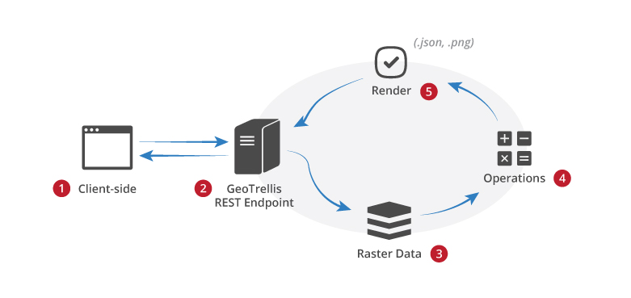

GeoTrellis SBT Learning
=======================

This is a bare-bones project template that can be used to begin any new
application that uses GeoTrellis.

An `sbt` bootstrapping script is also supplied, so you don't even need to
have `sbt` installed on your system.


##  Geo Trellis desc

1. 官网地址:https://geotrellis.io/
2. Githut 地址：https://github.com/locationtech/geotrellis
3. 应用实例：https://github.com/geotrellis

### Geo Trellis 功能特性：

Geo Trellis 是一个高性能的GIS数据处理引擎。

#### 高性能IO

Geo Trellis 基于Scala语言，支持快速的将不同类型栅格数据（raster data）并发写入磁盘。

#### 支持丰富操作

Geo Trellis 支持raster 数据的裁剪，转换，代数运算，数据渲染，矢量转栅格，核密度分析，矢量化等操作。

#### Web Service 服务

基于Akka，Geo Trellis 提供了丰富的Web Service Utilities，用于地图服务发布和访问。



#### 高性能计算

基于Geo Trellis 支持基于Spark分布式内存计算，并通过akka发布计算结果。同时Geo Trellis 支持将计算的结果

以图层（Layer）形式存储在HBase，Cassandra，HDFS等大数据存储服务上。提供快速的数据查询服务。


## Geo Trellis功能介绍

### 核密度分析

​     核密度分析工具用于计算要素在其周围邻域中的密度。此工具既可计算点要素的密度，也可计算线要素的密度。

​    核密度分析可用于测量建筑密度、获取犯罪情况报告，以及发现对城镇或野生动物栖息地造成影响的道路或公共设施管线。可使用 population 字段根据要素的重要程度赋予某些要素比其他要素更大的权重，该字段还允许使用一个点表示多个观察对象。例如，一个地址可以表示一栋六单元的公寓，或者在确定总体犯罪率时可赋予某些罪行比其他罪行更大的权重。对于线要素，分车道高速公路可能比狭窄的土路产生更大的影响，高压线要比标准电线杆产生更大的影响。

#### **点要素的核密度分析**

​    核密度分析用于计算每个输出栅格像元周围的点要素的密度。

​    概念上，每个点上方均覆盖着一个平滑曲面。在点所在位置处表面值最高，随着与点的距离的增大表面值逐渐减小，在与点的距离等于搜索半径的位置处表面值为零。仅允许使用圆形邻域。曲面与下方的平面所围成的空间的体积等于此点的 Population 字段值，如果将此字段值指定为 NONE 则体积为 1。每个输出栅格像元的密度均为叠加在栅格像元中心的所有核表面的值之和。核函数以 Silverman 的著作（1986 年版，第 76 页，方程 4.5）中描述的二次核函数为基础。

​    如果 population 字段设置使用的是除 NONE 之外的值，则每项的值用于确定点被计数的次数。例如，值 3 会导致点被算作三个点。值可以为整型也可以为浮点型。

​    默认情况下，单位是根据输入点要素数据的投影定义的线性单位进行选择的，或是在输出坐标系环境设置中以其他方式指定的。如果选择的是面积单位，则计算所得的像元密度将乘以相应因子，然后写入到输出栅格。

​    例如，如果输入单位为米，则输出面积单位将默认为平方千米。将以米和千米为单位的单位比例因子进行比较，将得到相差 1,000,000（1,000 米 x 1,000 米）倍的值。

​    增大半径不会使计算所得的密度值发生很大变化。虽然更大的邻域内将包含更多的点，但计算密度时点数将除以更大的面积。更大半径的主要影响是计算密度时需要考虑更多的点，这些点可能距栅格像元更远。这样会得到更加概化的输出栅格。

#### **线要素的核密度分析**

​    核密度分析还可用于计算每个输出栅格像元的邻域内的线状要素的密度。

​    概念上，每条线上方均覆盖着一个平滑曲面。其值在线所在位置处最大，随着与线的距离的增大此值逐渐减小，在与线的距离等于指定的搜索半径的位置处此值为零。由于定义了曲面，因此曲面与下方的平面所围成的空间的体积等于线长度与 Population 字段值的乘积。每个输出栅格像元的密度均为叠加在栅格像元中心的所有核表面的值之和。用于线的核函数是根据 Silverman 著作中所述的用于计算点密度的二次核函数改编的。


​    上图显示的是一条线段与覆盖在其上方的核表面。线段对密度的影响等同于栅格像元中心处核表面的值对密度的影响。

​    默认情况下，单位是根据输入折线 (polyline) 要素数据的投影定义的线性单位进行选择的，或是在输出坐标系环境设置中以其他方式指定的。

​    指定输出面积单位因子后，它会转换长度单位和面积单位。例如，如果线性单位是米，则输出面积单位将默认为平方千米而所得到的线密度单位将转换为千米/平方千米。将以米和千米为单位的面积比例因子相比较，最终结果将是相差 1,000 核密度分析,密度,倍的密度值。

​    您可以通过手动选择相应的因子来控制密度单位。要将密度单位设置为米/平方米（而不是默认的千米/平方千米），请将面积单位设置为平方米。同样，若要将输出的密度单位设置为英里/平方英里，请将面积单位设置为平方英里。

​    如果 population 字段使用的是除 NONE 之外的值，则线的长度将由线的实际长度乘以此线的 population 字段的值而得出。

#### 代码实现

核密度如下代码介绍了核密度分析过程：

```java
//1：定义随机坐标点
val pts = (for (i <- 1 to 1000) yield randomPointFeature(extent)).toList
val kernelWidth: Int = 9
/* 2：定义高斯和 deviation 1.5, amplitude 25 */
val kern: Kernel = Kernel.gaussian(kernelWidth, 1.5, 25)
//3：基于坐标数据做核计算
val kde: Tile = pts.kernelDensity(kern, RasterExtent(extent, 700, 400))
//4：定义渲染方式
val colorMap = ColorMap(
  (0 to kde.findMinMax._2 by 4).toArray,
  ColorRamps.HeatmapBlueToYellowToRedSpectrum
)
//5：将计算的结果写入到本地文件
kde.renderPng(colorMap).write(dataBasePath+"kerneldata/result.png")
```

上述基于点的核密度计算结果如下图：


### Spark ETL

#### Tiff数据读取：

基于栅格数据的操作第一步是需要读取该数据，geotrellis.raster.io.geotiff.reader提供了对tiff数据读取操作。如下方法实现**单波段和多波段**tiff数据的读取。

```java
def redTiff(path:String): Unit = {
  val tiffPath: String = dataBasePath+path
  //读取单波段image
  //val geoTiff: SinglebandGeoTiff = GeoTiffReader.readSingleband(tiffPath)
  //读取多波段image
  val geoTiff: MultibandGeoTiff = GeoTiffReader.readMultiband(tiffPath)
}
```

#### ETL任务定义：

##### ETL实现

ETL基于Spark分布式计算框架，将输入的数据分布到不同的计算资源上进行分布式计算，并收集计算结果和输出。以下代码实现了基于Tiff数据进行数据金字塔计算。

```java
def createTile(): Unit = {
  var args = Array[String](
    "--input",
    dataBasePath+"config/input.json",
    "--output",
    dataBasePath+"config/output.json",
    "--backend-profiles",
    dataBasePath+"config/backend-profiles.json"
  );
  System.out.println(args)
    //定义任务
  implicit val sc = SparkUtils.createSparkContext("ETL", new SparkConf(true).setMaster("local[*]"))
  try
    //提交任务
    Etl.ingest[ProjectedExtent, SpatialKey, Tile](args)
  finally {
    sc.stop
  }
}
```

ETL的实现代码和简单，其实核心只有一行  Etl.ingest[ProjectedExtent, SpatialKey, Tile](args)

下面我们看下Geo Trellis内部如何分配和计算这些任务的。

```scala
  def ingest[
    I: Component[?, ProjectedExtent]: TypeTag: ? => TilerKeyMethods[I, K],
    K: SpatialComponent: Boundable: TypeTag,
    V <: CellGrid: TypeTag: RasterRegionReproject: Stitcher: (? => TileReprojectMethods[V]): (? => CropMethods[V]): (? => TileMergeMethods[V]): (? => TilePrototypeMethods[V])
  ](
     args: Seq[String], modules: Seq[TypedModule] = Etl.defaultModules
   )(implicit sc: SparkContext) = {
    implicit def classTagK = ClassTag(typeTag[K].mirror.runtimeClass(typeTag[K].tpe)).asInstanceOf[ClassTag[K]]
    implicit def classTagV = ClassTag(typeTag[V].mirror.runtimeClass(typeTag[V].tpe)).asInstanceOf[ClassTag[V]]

    EtlConf(args) foreach { conf =>
      /* parse command line arguments */
      val etl = Etl(conf, modules)
      /* load source tiles using input module specified */
      val sourceTiles = etl.load[I, V]
      /* perform the reprojection and mosaicing step to fit tiles to LayoutScheme specified */
      val (zoom, tiled) = etl.tile(sourceTiles)
      /* save and optionally pyramid the mosaiced layer */
      etl.save[K, V](LayerId(etl.input.name, zoom), tiled)
    }
  }
}
```

上述代码的核心是读取配置文件，并通过for循环为不同zoom分配不同的计算任务。

##### ETL配置：

**Input.json 配置如下:**

该配置中定义了输入数据源格式为geotiff，名称为etlTest1，存储类型为hadoop，地址为…/TIF

```json
[{
  "format":"geotiff",
  "name":"etlTest1",
  "cache":"NONE",
  "backend":{
    "type":"hadoop",
    "path":"/Users/wangleigis163.com/Documents/alex/dev/code/private/cloud-map/data-server/110000BJ_L5_TM_1990/110000BJ_L5_TM_1990.TIF"
  }
}]
```


**output.json 配置如下:**

该配置中定义了输入数据源，tileSize=256，坐标系为EPSG:4326。

```json
 {
  "backend": {
    "type": "file",
    "path": "/Users/wangleigis163.com/Documents/alex/dev/code/private/cloud-map/data-server/110000BJ_L5_TM_1990/title"
  },
  "reprojectMethod": "buffered",
  "pyramid": true,
  "tileSize": 256,
  "keyIndexMethod": {
    "type": "zorder"
  },
  "resampleMethod": "nearest-neighbor",
  "layoutScheme": "zoomed",
  "crs": "EPSG:4326"
}

```

**backend.json 配置如下:**

backend.json定义了数据的遵循的schemas信息。

```json
{
  "backend-profiles":[]
}
```

计算后的金字塔数据结构如下：


### 金字塔（瓦片）数据转png

金字塔数据是特殊格式的数据，可用基于Geo Trellis集合akka进行服务发布。除此之外我们还可以将

通过FlieLayerReader将瓦片数据读取为TileLayerRDD，然后将TileLayer中的数据渲染为jpg按照瓦片规则将其写入磁盘。

```scala
def renderTile(): Unit = {
   val zoomId = 11
   implicit val sc = SparkUtils.createSparkContext("ReadLayer", new SparkConf(true).setMaster("local[*]"))
     //1:要读取的瓦片数据路径
    val path = dataBasePath+"/110000BJ_L5_TM_1990/title"  //图层文件根目录
    val store = FileAttributeStore(path)
    val reader = FileLayerReader(path)
    val layerId = LayerId("etlTest1", zoomId)  //设置图层名称和zoom
    //2：读取图层数据
    val layers: TileLayerRDD[SpatialKey] = reader.read[SpatialKey, Tile, TileLayerMetadata[SpatialKey]](layerId)
    //3：定义色带，非必须
    //   val colorMap1 = ColorMap(Map(
    //    0 -> RGB(0,0,0),
    //    1 -> RGB(255,255,255)
    //  ))
    val colorRamp = ColorRamp(RGB(0,0,0), RGB(255,255,255))
      .stops(100)
      .setAlphaGradient(0xFF, 0xAA)
    // 4: 定义输出路径，如果没有则创建
    val outputPath = dataBasePath+"/110000BJ_L5_TM_1990/render/" + zoomId  //图片输出路径
    val zoomDir: File = new File(outputPath)
    if (!zoomDir.exists()) {
        zoomDir.mkdirs()
     }
    //5：将瓦片图层数据渲染成jpg并安装规则写入磁盘
    layers.foreach(layer => {
      val key = layer._1
      val tile = layer._2
      val layerPath = outputPath + "/" + key.row + "_" + key.col + ".jpg"
      System.out.println(layerPath)
      tile.renderJpg(colorRamp).write(layerPath)  //调用渲染方法，colorRamp为非必须参数
    })
    sc.stop
}
```


基于上述转换好的的瓦片，我可可以通过web容器（Nginx，Tomcat，jetty）将其发布为web service。

### TMS服务发布

### 服务发布

我们通过etl生成了瓦片数据，基于该数据结合Geo Trills可以将其发布为TMS服务。

Geo Trills依靠akka对外提供服务。

```scala
import geotrellis.raster._
import geotrellis.spark._
import geotrellis.spark.io._
import geotrellis.spark.io.file._
import akka.actor._
import akka.event.{Logging, LoggingAdapter}
import akka.http.scaladsl.Http
import akka.http.scaladsl.model._
import akka.http.scaladsl.server.Directives.{path, _}
import akka.stream.{ActorMaterializer, Materializer}
import demo.Main.dataBasePath
import org.apache.hadoop.fs.Path

import scala.concurrent._
import geotrellis.raster.render.{ColorMap, ColorRamp, Png, RGB}
import geotrellis.spark.io.hadoop.{HadoopAttributeStore, HadoopLayerReader}


object Serve extends App with Service {
  //1：读取瓦片数据
  def dataBasePath = "/Users/wangleigis163.com/Documents/alex/dev/code/private/cloud-map/data-server/"
  var path=  dataBasePath+"/110000BJ_L5_TM_1990/title"
  val catalogPath = new java.io.File(path).getAbsolutePath
  val fileValueReader = FileValueReader(catalogPath)
  //2：基于瓦片数据定义数据渲染方法
  def reader(layerId: LayerId) = fileValueReader.reader[SpatialKey, BitArrayTile](layerId)
  //3:定义akka服务，并启动
  override implicit val system = ActorSystem("tutorial-system")
  override implicit val executor = system.dispatcher
  override implicit val materializer = ActorMaterializer()
  override val logger = Logging(system, getClass)
  Http().bindAndHandle(root,"localhost", 8080)
}
 //类的伴生对象
trait Service {
  implicit val system: ActorSystem
  implicit def executor: ExecutionContextExecutor
  implicit val materializer: Materializer
  val logger: LoggingAdapter
  //定义Colormap
  val colorRamp =
    ColorRamp(RGB(0,0,0), RGB(255,255,255))
      .stops(100)
      .setAlphaGradient(0xFF, 0xAA)

  val colorMap1 = ColorMap(Map(0 -> RGB(0,0,0), 1 -> RGB(255,255,255)))

  //定义http响应，这里想http响应内容修改为image/png，响应内存为图片的bytes形式
  def pngAsHttpResponse(png: Png): HttpResponse =
    HttpResponse(entity = HttpEntity(ContentType(MediaTypes.`image/png`), png.bytes))

  def root =
  // 根据zoom，x，y读取瓦片数据，具体个数为 http://localhost:8080/6/16/25
    pathPrefix(IntNumber / IntNumber / IntNumber) { (zoom, x, y) =>
      complete {
        Future {
          // Read in the tile at the given z/x/y coordinates.
          val tileOpt: Option[BitArrayTile] =
            try {
              Some(Serve.reader(LayerId("etlTest1", zoom)).read(x, y))
            } catch {
              case _: ValueNotFoundError =>
                None
            }
          tileOpt.map { tile =>
            // Render as a PNG
            val png = tile.renderPng(colorMap1)
            pngAsHttpResponse(png)
          }
        }
      }
    } ~
      pathEndOrSingleSlash {
        getFromFile("static/index.html")
      } ~
      pathPrefix("") {
        getFromDirectory("static")
      }
}
```

右键服务服务，在浏览器地址输入http://127.0.0.1:8080/1/2/3访问瓦片数据。具体如下图，通过浏览器调试我们发现已经有瓦片堆对外服务，只是该瓦片为白色。


#### 服务访问：

提供好服务后我们便可以基于API访问服务。访问服务的地址为http://localhost:8080/{z}/{x}/{y}.png。具体通过openlayers访问服务代码如下：

```javascript
// 1: esri 服务  
var url = 'https://sampleserver1.arcgisonline.com/ArcGIS/rest/services/' +
           'Specialty/ESRI_StateCityHighway_USA/MapServer';

//2：geo trills基于akka发布的瓦片服务
var  trafficLayer = new ol.layer.Tile({
                  source: new ol.source.XYZ({
                   url: 'http://localhost:8080/{z}/{x}/{y}.png'//
                })});
//3：Google瓦片服务
// var googleMapLayer = new ol.layer.Tile({
//                 source: new ol.source.XYZ({
//                     url: 'http://www.google.cn/maps/vt/pb=!1m4!1m3!1i{z}!2i{x}!3i{y}!2m3!1e0!2sm!3i380072576!3m8!2sen!3scn!5e1105!12m4!1e68!2m2!1sset!2sRoadmap!4e0!5m1!1e0'
//                 })
//             });
// 4: osm服务
// var layers = [
//   new ol.layer.Tile({
//     source: new ol.source.OSM()
//   })
// ];
//5：定义map并加载瓦片服务
var map = new ol.Map({
  layers: [trafficLayer],
  target: 'map',
  view: new ol.View({
          center: [559, 1686],
          zoom: 9
        })
  // new ol.View({
  //  center: ol.proj.transform([116.404269,39.935519], 'EPSG:4326', 'EPSG:900913')  ,
  //                   // projection: 'EPSG:4326',
  //                   zoom: 10
  // })
});

```

访问结果如下如


### 矢量（Vector）数据

Geo Trills提供了基本的矢量数据类型，具体如下：

```scala
type PointFeature[+D] = Feature[Point, D]
type LineFeature[+D] = Feature[Line, D]
type PolygonFeature[+D] = Feature[Polygon, D]
type MultiPointFeature[+D] = Feature[MultiPoint, D]
type MultiLineFeature[+D] = Feature[MultiLine, D]
type MultiPolygonFeature[+D] = Feature[MultiPolygon, D]
type GeometryCollectionFeature[+D] = Feature[GeometryCollection, D]
```


##### 矢量数据（点，线，面）操作：

```scala
//1：定义polygon并获取其多边形面积
var polygon = Polygon((10.0, 10.0), (10.0, 20.0), (30.0, 30.0), (10.0, 10.0))
System.out.println("polygon area:%s".format(polygon.area))
//2:定义一个点
var point = PointFeature(Point(0,0), "钟楼")
```

多边形提供的方法如下：


##### JSON和Feature互操作：

```js
val fc: String = """{
                   |  "type": "FeatureCollection",
                   |  "features": [
                   |    {
                   |      "type": "Feature",
                   |      "geometry": { "type": "Point", "coordinates": [1.0, 2.0] },
                   |      "properties": { "someProp": 14 },
                   |      "id": "target_12a53e"
                   |    }, {
                   |      "type": "Feature",
                   |      "geometry": { "type": "Point", "coordinates": [2.0, 7.0] },
                   |      "properties": { "someProp": 5 },
                   |      "id": "target_32a63e"
                   |    }
                   |  ]
                   |}""".stripMargin
                     
                  //从json转换为要素集合   
         val collection = fc.parseGeoJson[JsonFeatureCollectionMap]
```

**分布式矢量计算**

除了提供基本矢量操作方法外，Geo Trills还提供了分布式是空间矢量计算。以提高并行计算效率。点的分布式计算将点数据分布在不同的分区上来提高计算效率。

```scala
RDD[(SpatialKey, Array[Coordinate])]
```

基于更复杂的多边形空间计算，Geo Trills根据空间grid将空间区域分成不同分区，每个分区并行计算，然后骤步和并相邻分区（空间上临近）计算结果，最后将计算结果汇总。

```scala
RDD[(SpatialKey, DelaunayTriangulation)]
collectNeighbors()//相邻分区定义
geotrellis.util.Direction
```


### 数据存储

#### 栅格数据存储

Geo Trills 的数据以图层形式（可以理解为表的概念）存储在不同的类型的存储服务上。其支持的存储方式有

块存储和分布式系统存储。存储的核心数据有：

- Metadata：元数据
- Header (different per backend)：头文件
- Key Index：索引
- Schema：数据模式

##### 块存储

块存储为aws s3 、hdfs、Flie 文件系统。

##### 分布式数据库存储

HBase、Cassandra、GeowaveAttributeStore


1. ##### s3 

   ```scala
   //1 ： s3 数据存储和读取
    val uri = new URI("s3://bucket/catalog")
     val store = AttributeStore(uri)
     val reader = LayerReader(uri)
     val writer = LayerWriter(uri)
     val values = ValueReader(uri)
   ```

2. ##### Flie

   ```scala
   // 2:文件系统数据存储和读取
   val catalogPath: String = ""
   val flieStore: AttributeStore = FileAttributeStore(catalogPath)
   val reader = FileLayerReader(flieStore)
   val writer = FileLayerWriter(flieStore)
   val rootPath: Path = ""
   ```

3. ##### HDFS

   ```scala
   // 3:HDFS数据存储和读取
   val config: Configuration
   val store1: AttributeStore = HadoopAttributeStore(rootPath, config)
   val reader = HadoopLayerReader(store1)
   val writer = HadoopLayerWriter(rootPath, store1)
   ```

4. ##### HBase

   ```scala
   // 5:HBASE数据存储和读取
   val instance: HBaseInstance = ...
   val attrTable: String = ...
   val dataTable: String = ...
   implicit val sc: SparkContext = ...
   val store: AttributeStore = HBaseAttributeStore(instance, attrTable)
   val reader = HBaseLayerReader(store) /* Needs the implicit SparkContext */
   val writer = HBaseLayerWriter(store, dataTable)
   ```

5. ##### Cassandra

   ```scala
   // 4:Cassandra数据存储和读取
   val instance: CassandraInstance = ...
   val keyspace: String = ...
   val attrTable: String = ...
   val dataTable: String =
   implicit val sc: SparkContext = ...
   val store: AttributeStore = CassandraAttributeStore(instance, keyspace, attrTable)
   val reader = CassandraLayerReader(store) /* Needs the implicit SparkContext */
   val writer = cassandra.CassandraLayerWriter(store, instance, keyspace, dataTable)
   ```

#### 矢量数据存储

矢量数据存储在 [GeoMesa](http://www.geomesa.org/) and [GeoWav](https://github.com/ngageoint/geowave)上。

## 扩展说明

1：azavea全方位GIS方案：https://www.azavea.com/work/


